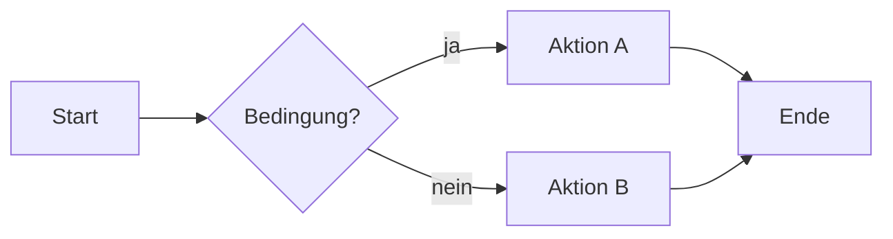

# Erstes Kapitel

> **Klausurrelevanz:** Blockquotes, die mit *Klausurrelevanz* beginnen, werden
> automatisch als hervorgehobener Callout dargestellt. Nutze sie für Kernaussagen.

Dies ist ein **Beispielkapitel**. Der Titel oben (erste `#`-Überschrift) wird zum
Seitentitel; die Kapitelnummer kommt aus dem Dateinamen-Präfix `01-`. Ersetze den
gesamten Inhalt durch deinen Stoff — Struktur und Konventionen kannst du
übernehmen.

## Ein Abschnitt (H2)

Abschnitte mit `##` und `###` erscheinen automatisch in der Seiten-Navigation
(rechte Spalte) und in der Volltextsuche. Fließtext, **Fett**, *Kursiv* und
`Inline-Code` funktionieren wie gewohnt.

### Ein Unterabschnitt (H3)

- Aufzählungen
- mit mehreren Punkten
- für Listen von Begriffen

1. Nummerierte Listen
2. für Abläufe

## Tabelle

| Begriff | Bedeutung | Beispiel |
| --- | --- | --- |
| Abstraktion | Weglassen von Details | Klassendiagramm |
| Kohäsion | Zusammengehörigkeit innerhalb einer Einheit | hoch = gut |

## Diagramm (Mermaid)

Mermaid-Codeblöcke werden als Diagramm gerendert (mit Zoom-Funktion):



## Codebeispiel

```js
function beispiel() {
  return 'Syntax-Highlighting funktioniert'
}
```

## Klausurfragen — Musterantworten

> Dieser Abschnitt (`## Klausurfragen …`) speist die **Karteikarten**. Jede Karte
> beginnt mit `**N. Frage?**` (fett, Zahl, Punkt, Leerzeichen). Vorderseite = die
> fette Zeile, Rückseite = alles danach bis zur nächsten `**N.`-Karte.

**1. Was ist die Vorderseite dieser Karteikarte?**

Die fett gesetzte, nummerierte Frage ist die Vorderseite. Dieser Absatz — alles bis
zur nächsten `**2.`-Karte — ist die Rückseite (Antwort).

**2. Wie fügt man eine weitere Karte hinzu?**

Neue nummerierte Frage `**3. …**` in diesem Abschnitt ergänzen. Die Nummerierung
ist kapitel-intern und läuft fortlaufend ab `**1.`.
